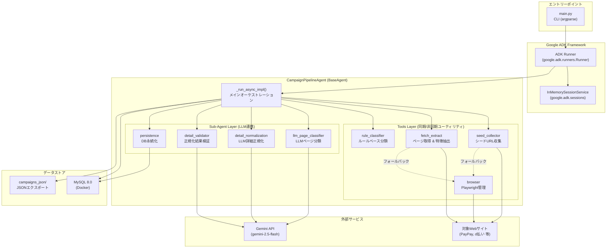
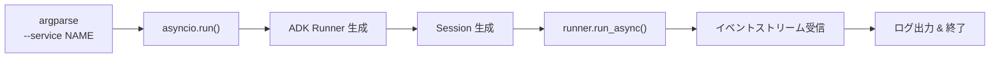
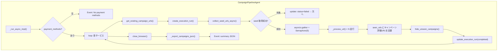
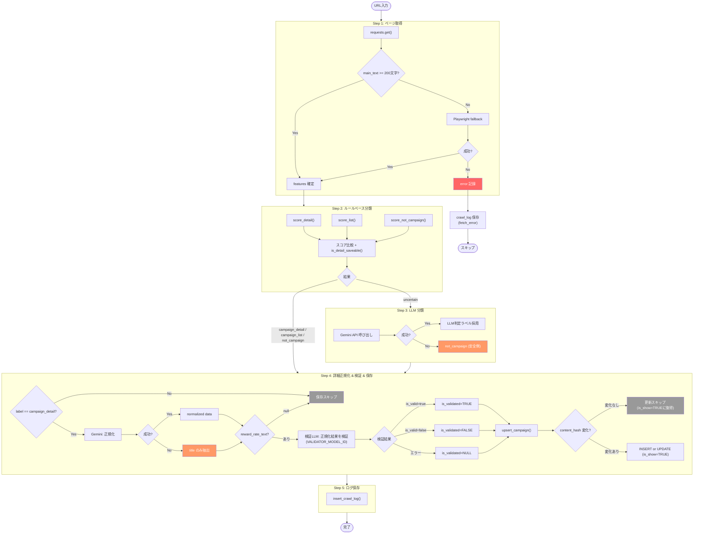
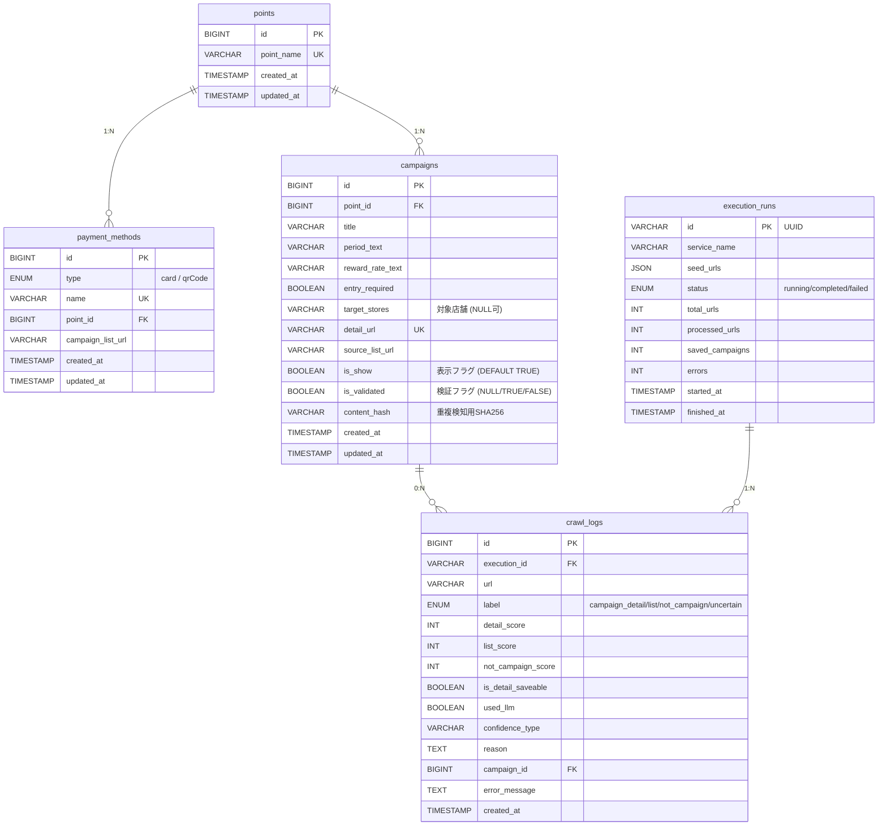
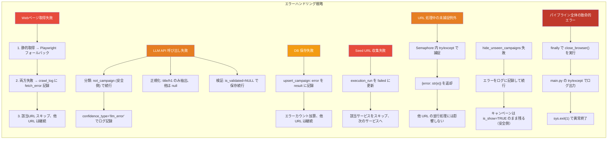

# ADK 設計書 — キャンペーン収集パイプライン

## システム概要図

## コンポーネント詳細

### 1. エントリーポイント (`main.py`)

| 項目 | 内容 |
|------|------|
| フレームワーク | Google ADK (`google.adk`) |
| セッション管理 | `InMemorySessionService`（揮発性、実行単位） |
| 引数 | `--service` で対象サービス絞り込み（省略時: 全サービス） |

### 2. ルートエージェント (`CampaignPipelineAgent`)

| 項目 | 内容 |
|------|------|
| 基底クラス | `google.adk.agents.BaseAgent` |
| 並行度 | `asyncio.Semaphore(5)` — URL 処理を最大5並行 |
| LLM 呼び出し | `google.genai.Client` で Gemini API を直接呼び出し |
| 出力形式 | `response_mime_type="application/json"` で JSON を強制 |
| 検証モデル | `VALIDATOR_MODEL_ID` 環境変数で独立設定（デフォルト: gemini-2.5-flash-lite） |

### 3. URL 処理パイプライン (`_process_url`)

### 4. データモデル (MySQL)

## エラーハンドリング設計

### エラー分類と復旧方針

| レベル | 発生箇所 | 影響範囲 | 復旧方針 |
|--------|----------|----------|----------|
| **Low** | 個別URL取得失敗 | 1 URL | フォールバック → スキップ。他URLに影響なし |
| **Low** | LLM API エラー (分類/正規化) | 1 URL | 安全側デフォルト値で続行 |
| **Low** | 検証LLM エラー | 1 URL | is_validated=NULL で保存続行（検証不能） |
| **Low** | 検証失敗 (is_valid=false) | 1 キャンペーン | is_validated=FALSE で保存し人手レビュー可能に |
| **Medium** | DB保存失敗 | 1 キャンペーン | エラー記録して続行。次回実行で再取得可能 |
| **Medium** | Seed URL 収集失敗 | 1 サービス全体 | サービスをスキップ。他サービスは継続 |
| **Low** | 非表示処理失敗 | 1 サービス | エラーログ記録して続行。is_show=TRUE のまま（安全側） |
| **High** | 未捕捉例外 | パイプライン全体 | ブラウザを安全に閉じて終了 |

### リトライ方針

- **即時リトライは行わない** — 同一実行内でのリトライは実装していない
- **フォールバック戦略** — 静的取得 → Playwright の2段構え
- **冪等性** — `content_hash` による重複検知で、再実行しても安全に差分更新
- **再実行** — パイプラインを再度実行すれば `ON DUPLICATE KEY UPDATE` で最新化される
- **更新フロー** — 再実行時、発見されたキャンペーンは `is_show=TRUE`、見つからなかったものは `is_show=FALSE` に更新
