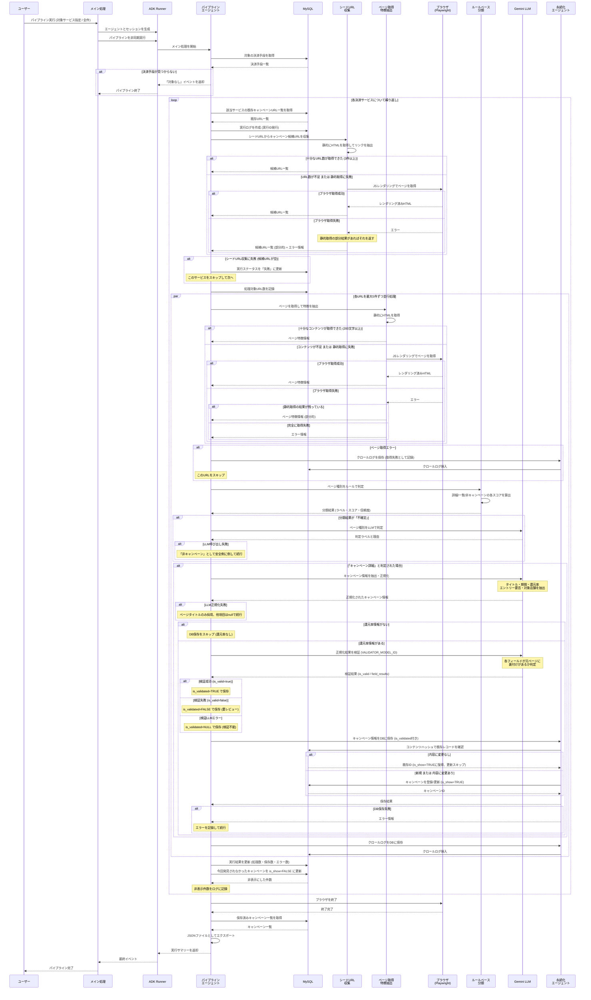

# キャンペーン情報取得処理 シーケンス図

## エラー時の対応一覧

| # | エラー発生箇所 | エラー内容 | 対応 |
|---|---|---|---|
| 1 | **シードURL収集 (静的取得)** | HTTP通信エラー | Playwright にフォールバック。Playwright も失敗した場合は静的取得の部分結果を使用。両方失敗ならエラーを返す |
| 2 | **シードURL収集 (Playwright)** | ブラウザ取得エラー | 静的取得の部分結果があればそれを返却。なければ空URLリスト + エラー |
| 3 | **シードURL収集結果** | エラーあり / URLが空 | 実行ログを「失敗」に更新し、このサービスをスキップして次のサービスへ |
| 4 | **ページ取得 (静的取得)** | HTTP通信エラー | Playwright にフォールバック |
| 5 | **ページ取得 (Playwright)** | ブラウザ取得エラー | 静的取得のHTMLが残っていればそこから特徴抽出。完全失敗ならエラーを返す |
| 6 | **ページ取得結果** | エラーあり | クロールログに「取得失敗」として記録し、このURLをスキップ |
| 7 | **LLMページ分類** | API呼び出し失敗 / JSONパース失敗 | 「非キャンペーン」として安全側に倒して続行 |
| 8 | **LLM詳細正規化** | API呼び出し失敗 / JSONパース失敗 | ページのタイトルのみ採用し、他フィールドはnullで続行 |
| 9 | **還元率未検出** | 正規化結果に還元率なし | DB保存をスキップ（ログのみ記録） |
| 9.5 | **検証LLM呼び出し** | API呼び出し失敗 / JSONパース失敗 | is_validated=NULL で保存続行（検証不能として扱う） |
| 9.6 | **検証結果** | 検証失敗 (is_valid=false) | is_validated=FALSE で保存し、後から人手レビュー可能にする |
| 10 | **DB保存** | データベースエラー | エラー情報を返却、エラーカウントに加算して続行 |
| 11 | **URL処理全体** | 未捕捉の例外 | 並行処理内で捕捉しエラー情報を返却、他URLの処理は継続 |
| 12 | **非表示処理** | DB更新失敗 | エラーをログに記録して続行。キャンペーンは is_show=TRUE のまま残る（安全側） |
| 13 | **パイプライン全体** | 致命的エラー | finally でブラウザを確実に終了。メイン処理で異常終了コードを返す |
