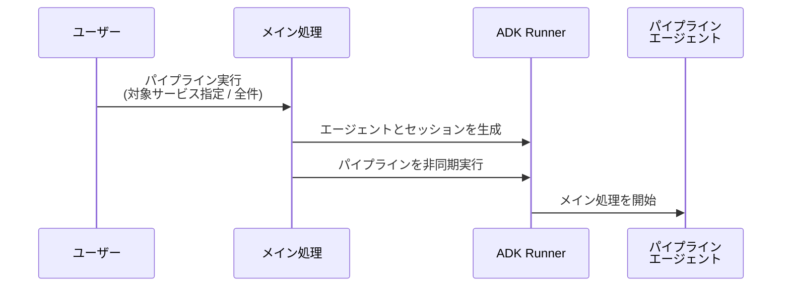
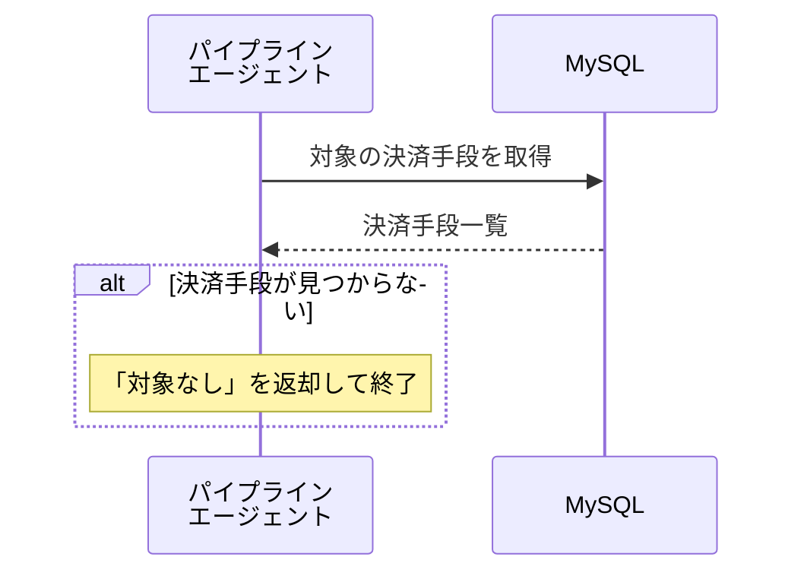
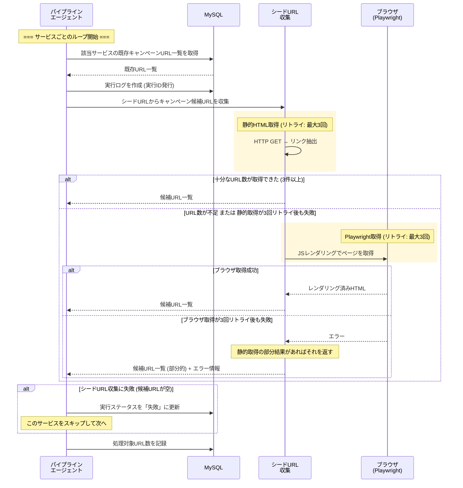
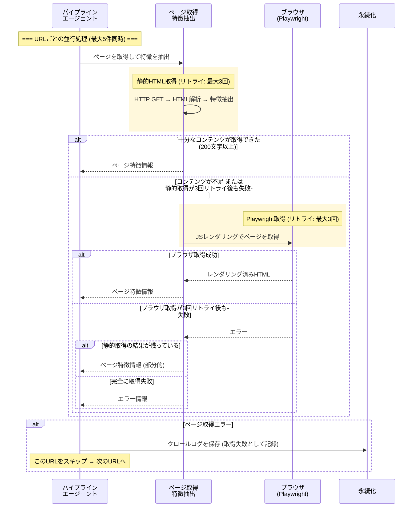
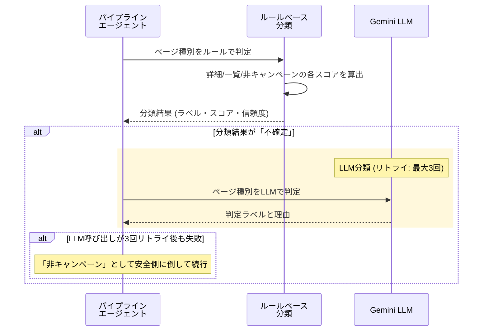
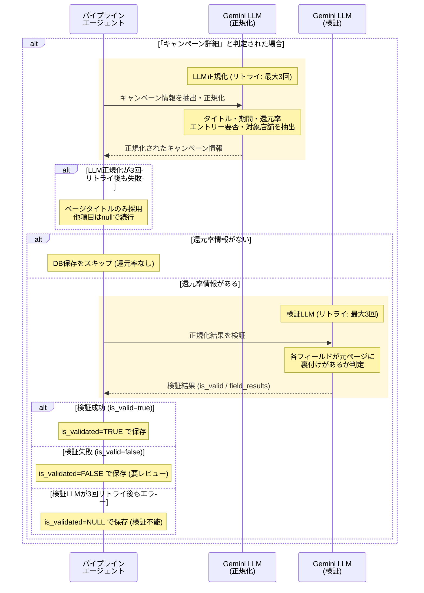
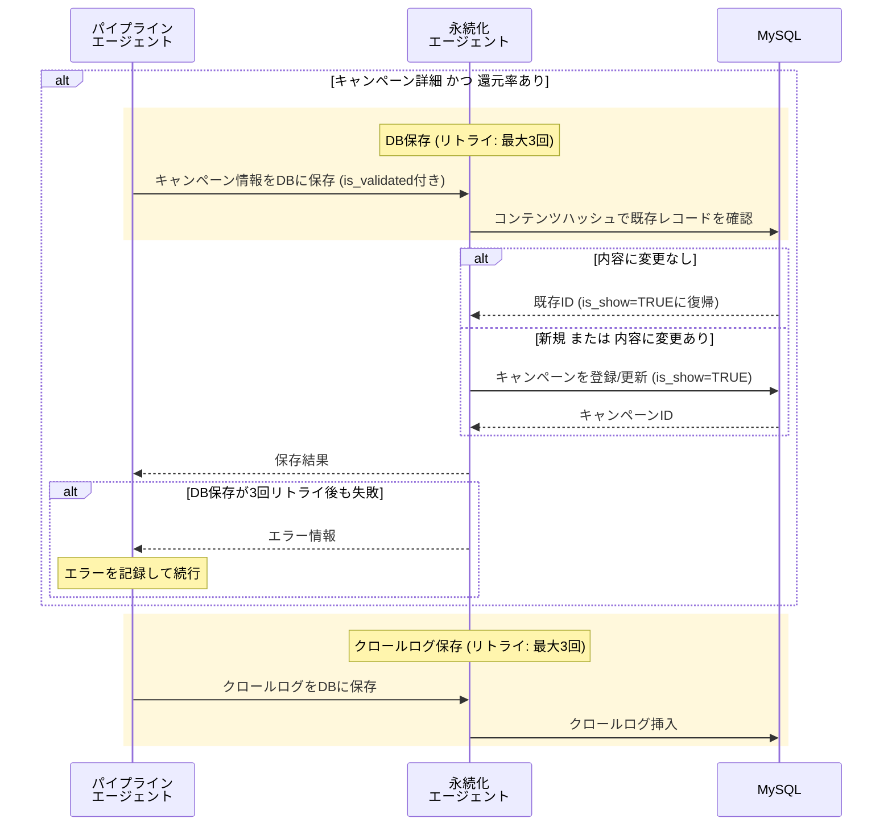
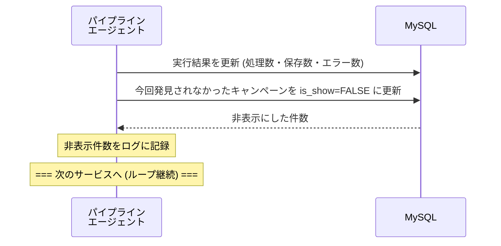
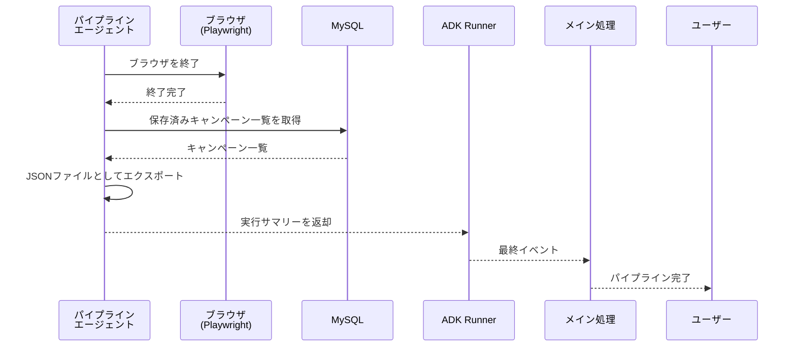

# キャンペーン情報取得パイプライン シーケンス図

## 全体フロー概要

```
1. 起動・初期化
2. 決済手段の取得
3. サービスごとのループ
   3-1. シードURL収集
   3-2. URLごとの並行処理
       3-2-1. ページ取得 & 特徴抽出
       3-2-2. ルールベース分類
       3-2-3. LLM分類 (不確定時)
       3-2-4. キャンペーン詳細抽出 & 正規化
       3-2-5. 検証 (バリデーション)
       3-2-6. DB保存
       3-2-7. クロールログ保存
   3-3. 未発見キャンペーンの非表示処理
4. 後処理 & 結果返却
```

> **リトライポリシー**: 全ての外部通信 (HTTP / Playwright / LLM API / DB) は **最大3回リトライ**（指数バックオフ: 1秒 → 2秒 → 4秒）

---

## 1. 起動・初期化



---

## 2. 決済手段の取得



---

## 3-1. シードURL収集



---

## 3-2-1. ページ取得 & 特徴抽出



---

## 3-2-2〜3. ルールベース分類 & LLM分類



---

## 3-2-4〜5. キャンペーン詳細抽出 & 検証



---

## 3-2-6〜7. DB保存 & クロールログ



---

## 3-3. 未発見キャンペーンの非表示処理



---

## 4. 後処理 & 結果返却



---

## リトライポリシー

| 設定項目 | デフォルト値 | 環境変数 |
|---|---|---|
| 最大リトライ回数 | 3 | `MAX_RETRIES` |
| バックオフ基準秒数 | 1.0秒 | `RETRY_BACKOFF_BASE` |
| バックオフ計算式 | `base × 2^(attempt-1)` | — |

**リトライ間隔の例 (デフォルト):**

| 試行 | 待機時間 | 累積待機時間 |
|---|---|---|
| 1回目 | 即時実行 | 0秒 |
| 2回目 (リトライ1) | 1秒 | 1秒 |
| 3回目 (リトライ2) | 2秒 | 3秒 |
| (打ち切り) | — | 最大約7秒 |

---

## エラー時の対応一覧

| # | エラー発生箇所 | リトライ | 対応 |
|---|---|---|---|
| 1 | **シードURL収集 (静的取得)** | 最大3回 | 3回失敗 → Playwright にフォールバック |
| 2 | **シードURL収集 (Playwright)** | 最大3回 | 3回失敗 → 静的取得の部分結果があればそれを返却。なければ空URLリスト + エラー |
| 3 | **シードURL収集結果** | — | エラーあり / URLが空 → 実行ログを「失敗」に更新し、このサービスをスキップして次へ |
| 4 | **ページ取得 (静的取得)** | 最大3回 | 3回失敗 → Playwright にフォールバック |
| 5 | **ページ取得 (Playwright)** | 最大3回 | 3回失敗 → 静的取得HTMLが残っていれば特徴抽出。完全失敗ならエラー返却 |
| 6 | **ページ取得結果** | — | エラーあり → クロールログに「取得失敗」として記録し、このURLをスキップ |
| 7 | **LLMページ分類** | 最大3回 | 3回失敗 → 「非キャンペーン」として安全側に倒して続行 |
| 8 | **LLM詳細正規化** | 最大3回 | 3回失敗 → ページタイトルのみ採用し、他フィールドはnullで続行 |
| 9 | **還元率未検出** | — | 正規化結果に還元率なし → DB保存をスキップ（ログのみ記録） |
| 10 | **検証LLM呼び出し** | 最大3回 | 3回失敗 → is_validated=NULL で保存続行（検証不能として扱う） |
| 11 | **検証結果** | — | 検証失敗 (is_valid=false) → is_validated=FALSE で保存し、後から人手レビュー可能にする |
| 12 | **DB保存 (キャンペーン)** | 最大3回 | 3回失敗 → エラー情報を返却、エラーカウントに加算して続行 |
| 13 | **DB保存 (クロールログ)** | 最大3回 | 3回失敗 → エラーをログに記録して続行 |
| 14 | **URL処理全体** | — | 並行処理内で捕捉しエラー情報を返却、他URLの処理は継続 |
| 15 | **非表示処理** | — | DB更新失敗 → エラーをログに記録して続行 (is_show=TRUE のまま残る＝安全側) |
| 16 | **パイプライン全体** | — | finally でブラウザを確実に終了。メイン処理で異常終了コードを返す |
